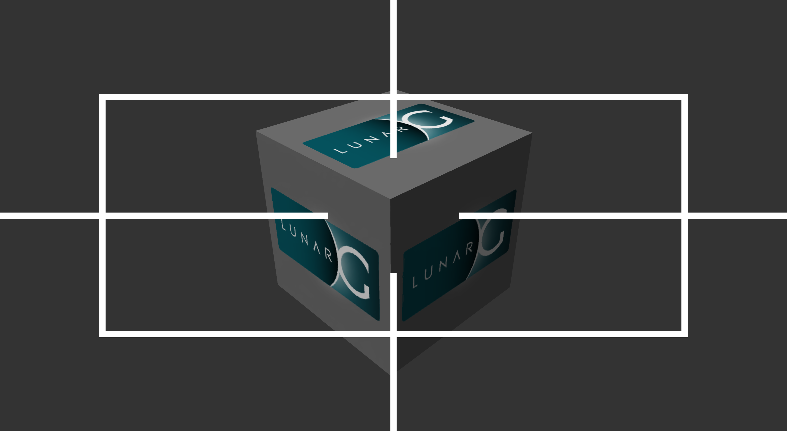

# krosshair - Crosshair Overlay for Games on Linux

* Works on **Native / Non-Flatpak** systems (e.g. Arch Linux, CachyOS, Ubuntu etc.)
* Works on **Flatpak** systems (e.g.Bazitte).
* Works with **Steam** and **non-Steam** games.


## This Fork - Differences to `noahlyk/krosshair`

* Hotkey added to toggle the crosshair (press `SHIFT_R` + `F9`, see `Usage` chapter below on how to change the hotkey).
* Rendering fixed on 4K and other resolutions ([PR](https://github.com/noahlyk/krosshair/pull/2)).
* Flatpak build added ([PR](https://github.com/noahlyk/krosshair/pull/1)).

<br>

# Demo - Default Dot Crosshair
Screenshot showing the default crosshair. To use a different crosshair place one of the files in repo dir `crosshairs` at `~/.config/crosshair-maker/projects/current.png` or use env var `KROSSHAIR_IMG` to load it from a different location.


<br>

# Demo - Anti Motion Sickness Overlay
This is an overlay (not really a crosshair) which helps against motion sickness in first person games. You can find it in the repo: `crosshairs/anti-motionsickness-1_<resolution>.png`.



<br>

# Installation

## Non-Flatpak Installation

## <del>Option 1: Via Arch Linux AUR</del>

This fork (jfingerle/krosshair-flatpak) is currently not available on the AUR, only the original [noahlyk/krosshair](https://github.com/noahlyk/krosshair) fork.

## Option 2: Build from Source

```bash
git clone https://github.com/jfingerle/krosshair-flatpak.git
cd krosshair
make install
```

## Flatpak Installation

Necessary if your games (and apps like Steam / Lutris / Heroic) run via Flatpak. This is for example the case on Bazzite and other immutable Linux distributions.

After the installation you need to restart all Flatpak apps which you use to run games (Steam, Heroic, Lutris etc.).

### Option 1: Download Github Release
- Download **all** .flatpack files from the [releases page](https://github.com/jfingerle/krosshair-flatpak/releases).
- Install via double-clicking the file in your file manager (or run `flatpak install (--user) filename.flatpak` in your terminal).


### Option 2: Build from Source

Builds and installs Flatpak bundles for the supported runtime versions (24.08, 25.08, 26.08).

```bash
sudo pacman -S flatpak-builder
git clone https://github.com/jfingerle/krosshair-flatpak.git
cd krosshair
make flatpak-install
```

### Set Flatpak Permissions
If you want to use other crosshairs (instead of the default dot crosshair) you need to allow your flatpak apps to (read-only) access dir `~/.config/crosshair-maker/projects`. To set a new default crosshair pick a crosshair from the `crosshairs` dir of this repo and place it at `~/.config/crosshair-maker/projects/current.png`. You can also place multiple crosshairs in the directory and set the env var `KROSSHAIR_IMG` to pick one of them (e.g. `KROSSHAIR_IMG=~/.config/crosshair-maker/projects/plus.png %command%` for Steam games).

```
flatpak override --user --filesystem=~/.config/crosshair-maker/projects:ro
```

Afterwards you need to restart all Flatpak apps which you use to run games (Steam, Heroic, Lutris etc.).

<br>

# Usage

## Steam Games

Add the follwoing launch option:

```
KROSSHAIR=1 %command%
```

To use a custom crosshair (from the `crosshairs` dir of this repo):

```
KROSSHAIR=1 KROSSHAIR_IMG=/optional/path/to/crosshair.png %command%
```

To use a different hotkey to toggle the crosshair add the `KROSSHAIR_HOTKEY_TOGGLE` env var like this:

```
KROSSHAIR=1 KROSSHAIR_HOTKEY_TOGGLE=SHIFT_R+F7 %command%
```

## Non-Steam Games

```bash
export KROSSHAIR=1
#export KROSSHAIR_IMG=/path/to/crosshair.png # To use a custom crosshair (from the `crosshairs` dir of this repo)
#export KROSSHAIR_HOTKEY_TOGGLE=SHIFT_R+F7 # To use a different hotkey to toggle the crosshair
your-game
```

<br>

# Make your own crosshairs using `crosshair-maker`

krosshair works out of the box with [crosshair-maker](https://github.com/noahlyk/crosshair-maker), a crosshair overlay creator with SVG rendering and preview. The currently selected crosshair is automatically exported to `~/.config/crosshair-maker/projects/current.png`, which krosshair picks up as its default — just launch your game with `KROSSHAIR=1` and go.

Use `export KROSSHAIR_IMG=/path/to/crosshair.png` to use a specific crosshair file.

To test the full setup together with `vkcube`:

```sh
$ yay -Sy krosshair crosshair-maker vulkan-tools
$ KROSSHAIR=1 vkcube &
$ crosshair-maker &
```
<br>

# FAQ / Various

## Can i get banned for this?
This project is quite similar to `MangoHud` so it should be safe to use, but use it at your own risk. The original author has so for tested it in Quake Champions and STRAFTAT, both of which don't really have an anticheat.

## What hotkeys can I use?
The hotkey to toggle the crosshair can be set via env var `KROSSHAIR_HOTKEY_TOGGLE`. Any modifier (`shift_l`, `shift_r`, `ctrl_l`, `ctrl_r`, `alt_l`, `alt_r`) can be combined with a letter, digit, `f1`–`f24`, `space`, `tab`, `escape` etc. For example `KROSSHAIR_HOTKEY_TOGGLE=ctrl_r+1`

## Any known issues?
As of now, the overlay leaks a bit of memory everytime you alt-tab out of/into the game, as well as everytime the window is being resized and upon resolution changes. It's not a big leak and shouldn't cause any problems, but it's still worth noting.
I've tried fixing it multiple times but have always hit a dead-end. If someone more experienced with vulkan wants to help, take a look at [this issue](https://github.com/krob64/krosshair/issues/1). I know it's a bit of a mess, this whole project is based on a morally questionable apex legends project which i'm unsure if i should link to it here, coupled with me jumping into it right after completing the vulkan tutorial.
